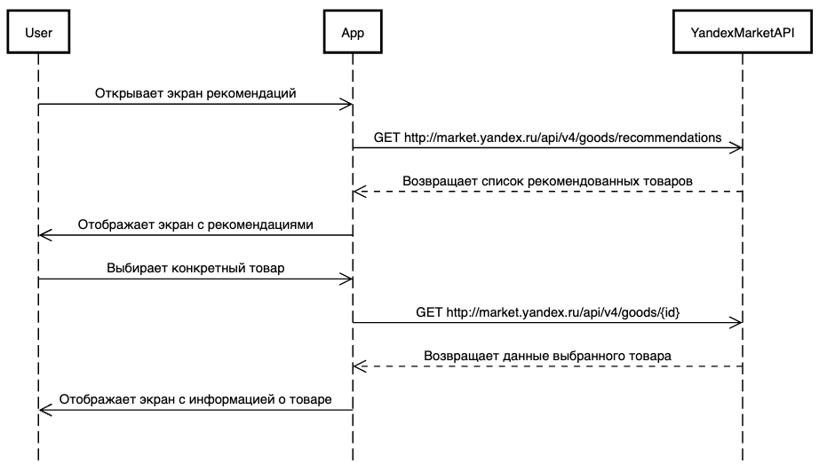
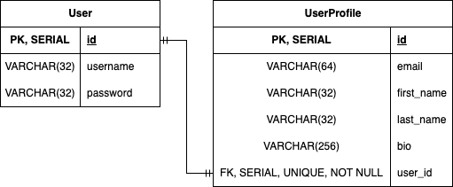
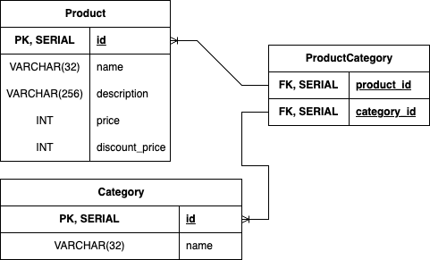

# Effective Mobile (Junior System Analyst) Test Task
- ## Task 1
<p align="center">
    
</p>


REST API GET запрос для перехода на страницу рекоммендаций:
```http://market.yandex.ru/api/v4/goods/recommendations``` 

Response:
```json
{
    "message": "List of goods",
    "status_code": 200,
    "timestamp": "2024-07-29T15:25:45.875024+03:00",
    "goods": [
        {
            "id": 1,
            "name": "Наручные часы CASIO Collection LTP-VT02BL-3A",
            "currency_symbol": "₽",
            "price": 4539,
            "discount_price": 3440,
            "image_refference": "/img/watches/casio/LTP-VT02BL-3A.png"

        },
        {
            "id": 2,
            "name": "Стеллаж для книг KM LOFT Ромбо черный/дуб вотан",
            "currency_symbol": "₽",
            "price": 42990,
            "discount_price": 9407,
            "image_refference": "/img/furniture/bookshelf/KM_LOFT_Ромбо_черный/дуб_вотан.png"

        },
        {
            "id": 3,
            "name": "Полка настенная ChoodWood 60x20 см из массива дерева карагач_1",
            "currency_symbol": "₽",
            "price": 8918,
            "discount_price": 2520,
            "image_refference": "/img/furniture/bookshelf/ChoodWood_60x20_см_карагач.png"

        },
        {
            "id": 4,
            "name": "Тумба прикроватная из МДФ Белая ноги золото 50x50x40 см",
            "currency_symbol": "₽",
            "price": 4539,
            "discount_price": 3440,
            "image_refference": "/img/furniture/bedside_cabinet МДФ_Белая_ноги_золото_50x50x40_см.png"
        }
    ]
}
```


- ## Task 2

Sequence UML диаграмма (.png):



Sequence UML диаграмма (код):
```
sequenceDiagram
    participant User
    participant App
    participant YandexMarketAPI

    User->>App: Открывает экран рекомендаций
    App->>YandexMarketAPI: GET http://market.yandex.ru/api/v4/goods/recommendations
    YandexMarketAPI-->>App: Возвращает список рекомендованных товаров
    App->>User: Отображает экран с рекомендациями

    User->>App: Выбирает конкретный товар
    App->>YandexMarketAPI: GET http://market.yandex.ru/api/v4/goods/{id}
    YandexMarketAPI-->>App: Возвращает данные выбранного товара
    App->>User: Отображает экран с информацией о товаре
```

REST API GET запрос для перехода на страницу товара:
```http://market.yandex.ru/api/v4/goods/{id}```

Response:
```json
{
    "message": "Good's info",
    "status_code": 200,
    "timestamp": "2024-07-29T15:25:45.875024+03:00",
    "id": 3,
    "name": "Полка настенная ChoodWood 60x20 см из массива дерева карагач",
    "description": "Открытые навесные полки - современная и стильная система хранения, которая впишется в любой интерьер. Парящая полка покрыта лаком, имеет живой край и выполнена из массива твердых пород дерева...",
    "currency_symbol": "₽",
    "price": 8918,
    "discount_price": 2520,
    "image_refferences": [
        "/img/furniture/bookshelf/ChoodWood_60x20_см_карагач_1.png",
        "/img/furniture/bookshelf/ChoodWood_60x20_см_карагач_2.png",
        "/img/furniture/bookshelf/ChoodWood_60x20_см_карагач_3.png",
        "/img/furniture/bookshelf/ChoodWood_60x20_см_карагач_4.png",
        "/img/furniture/bookshelf/ChoodWood_60x20_см_карагач_5.png",
        ],
    "comments": [
        {
        "id": 1,
        "timestamp": "2024-07-07T12:20:10.873024+06:00",
        "author_id": 22,
        "text": "Отличный товар!",
        "rating": 5
        },
        {
        "id": 2,
        "timestamp": "2024-07-16T23:00:57.873024+03:00",
        "author_id": 47,
        "text": "Ужасный товар!!! НЕ РЕКОМЕНДУЮ!",
        "rating": 2
        },
    ]
}
```

- ## Task 3
ER диаграммы (физический уровень):
- One-to-One:


- Many-to-Many:



- ## Task 4
Тест по базам данных.

Ответы:
1. C. NoSQL БД с JSON структурой данных.
2. C. Для улучшения производительности поиска
3. C. Число строк таблицы, указанной во FROM, включая значение NULL
4. D. Функции не применяются, исключение COUNT
5. C. UNION удаляет все полные дубликаты при объединении данных, а UNION ALL объединяет вместе с дубликатами